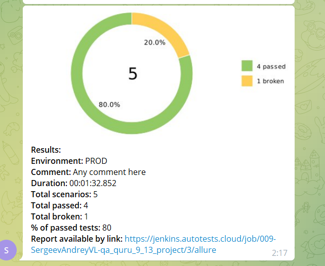

# Проект автотестов на сайт SemRush

## Покрыт следующий функционал
* UI тесты
    * ✅ Проверка отображения страницы Тарифы
    * ✅ Проверка отображения страницы Топовые веб-сайты
    * ✅ Проверка отображения страницы Контакты
    * ✅ Проверка авторизации и отображения личного кабинета
    * ✅ Проверка отображения страницы SEMrush API

## Технологический стек
Java, Gradle, JUnit5, IntelliJ IDEA, Selenide, Jenkins, Allure TestOps, Jira, Github, Telegram

<p  align="center"

<code>


</code>
</p>

## Как запустить


### Локально
```
gradle clean test
```


### Запуск в Jenkins
<p  align="center"
<code>

</code>

### Отчёт о прохождении автотестов в Allure Report
<p  align="center"
<code>

</code>

### Список автотестов в Allure Report
<p  align="center"
<code>

</code>
</p>

### Уведомления о прохождении автотестов в Telegram
<p  align="center"
<code>

</code>
</p>
